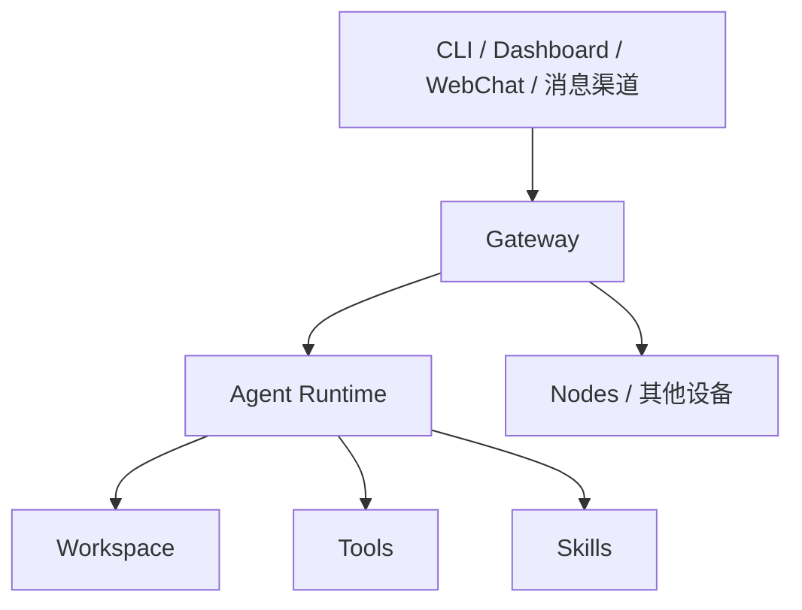

# OpenClaw 科普、Skill 与部署指南

## 前言

如果你最近经常在 AI Agent 圈里看到 **OpenClaw**，最容易产生的误解是：它是不是又一个“AI 编程壳子”？

更准确地说，**OpenClaw 是一个本地优先（local-first）的个人 AI 助手 / Agent 框架**。它的目标不是只在终端里回答问题，而是把模型、工具、工作空间、消息渠道、自动化和设备能力整合进一个长期运行的控制平面里。你可以把它理解成：

> 一个跑在你自己设备上的 AI 助手中枢，既能在 CLI / Web UI 里工作，也能接入 Telegram、Slack、Discord 等消息渠道，并通过 Skill、Tools、Nodes 扩展能力。

> [!INFO] TL;DR
> - **OpenClaw 不只是 CLI**，它更像一个长期运行的个人 AI 助手平台
> - 核心中枢是 **Gateway**，默认跑在 `127.0.0.1:18789`
> - **Skill** 本质上是可复用的工作流说明，通常以 `SKILL.md` 形式存在
> - 对新手最友好的部署路径是：**安装 CLI → `openclaw onboard --install-daemon` → `openclaw dashboard`**
> - 如果你想隔离运行环境，可选 **Docker**；如果你想 rootless 容器部署，可看 **Podman**

## OpenClaw 是什么？

根据 OpenClaw 官方 README，OpenClaw 是一个运行在你自己设备上的 **personal AI assistant**。它支持通过多种消息渠道与你交互，例如 WhatsApp、Telegram、Slack、Discord、Google Chat、Signal、iMessage、Feishu 等，同时也支持 Web UI、CLI、语音和节点设备能力。

和常见“只会在终端里回答你”的 AI 工具相比，它更强调两件事：

1. **长期运行**：不是一次性问答，而是有一个常驻的 Gateway 在背后维持状态
2. **多入口统一**：CLI、Dashboard、消息渠道、节点设备都接到同一个控制平面

这也是为什么 OpenClaw 的官方文档一直在强调：**Gateway 只是 control plane，真正的产品是你的 assistant 本身**。

## 它适合什么人？

比较适合以下几类用户：

- 想把 AI 助手长期接到自己常用消息渠道的人
- 希望 AI 能稳定访问本地工作区、浏览器、自动化工具的人
- 想把 Skill / Tool / 节点能力组合成个人工作流的人
- 对“本地优先、自己掌控数据和部署”有明确偏好的人

如果你只是想要一个轻量级终端编程助手，OpenClaw 可能显得偏重；但如果你想要的是一个 **长期在线、可扩展、可部署、可路由的个人 Agent 平台**，它就很有吸引力。

## 一张图理解 OpenClaw 的核心结构



### 1. Gateway

Gateway 是 OpenClaw 的中枢。根据官方架构文档，它是一个长期运行的单进程，负责：

- 管理消息渠道连接
- 暴露 WebSocket 控制平面接口
- 为 CLI、Web UI、nodes 提供统一入口
- 处理事件、会话和路由

默认连接地址是 `127.0.0.1:18789`。

### 2. Agent Runtime

Agent Runtime 负责真正执行一轮任务：读取上下文、调用模型、选择工具、执行工作流、输出结果。你可以把它理解成“会干活的智能体执行层”。

### 3. Workspace

官方文档把 Workspace 视为 agent 的默认工作目录。很多文件读写、脚本执行、上下文收集都围绕这个目录进行。对使用者来说，这很重要，因为它决定了：

- AI 默认在哪个目录里工作
- 哪些文件会被它看到
- 你的项目级 Skill 放在哪里最自然

### 4. Skills

Skill 不是“插件 UI”，而是**把某个可重复工作流固化下来的一套说明和约束**。这也是 OpenClaw 很有意思的地方：它不是只堆功能，而是把“怎么稳定地做一类事”抽成 Skill。

## Skill 到底是什么？

官方文档对 Skill 的定义很直接：

> Skills let you turn a repeatable workflow into something consistent.

翻译成人话就是：

**如果某件事你希望 AI 以后都按固定套路来做，就把它写成 Skill。**

比如：

- 固定格式写周报
- 固定方式排查 CI 问题
- 固定流程生成某种文档
- 固定步骤部署某个服务

### 一个 Skill 的典型结构

OpenClaw 官方文档里最常见的形式是一个目录，里面至少包含一个 `SKILL.md`：

```text
<workspace>/skills/<skill-name>/SKILL.md
```

或者：

```text
~/.openclaw/skills/<skill-name>/SKILL.md
```

`SKILL.md` 通常包含两部分：

1. **YAML frontmatter**：名字、描述等元信息
2. **Markdown 正文**：什么时候用、步骤是什么、输出格式如何、哪些事情不能做

一个最小示例可以写成：

```markdown
---
name: hello_world
description: A simple skill that says hello.
---

# Hello World Skill

When the user asks for a greeting, respond with a short hello message.
```

### Skill 更像“工作方法模板”

这点很关键。很多人第一次接触时会把 Skill 理解成“函数库”或“插件商店条目”，但更贴近的理解是：

- **Tools** 决定“能不能做”
- **Skills** 决定“怎么更稳定地做”

也就是说，Tool 像器官，Skill 像经验、SOP 和动作模板。

## Skill 的加载位置与优先级

官方文档给出的常见加载层级是：

1. **Bundled skills**：随 OpenClaw 一起提供的内置 Skill
2. **Managed / local skills**：通常位于 `~/.openclaw/skills`
3. **Workspace skills**：位于 `<workspace>/skills`

其中，**workspace 级 Skill 通常优先级更高**，因为它更贴近当前项目。

这套设计非常适合实际工作：

- 全局层放通用能力
- 项目层放当前仓库专属规则

## 怎么查看、检查和管理 Skill？

官方 CLI 文档给出了这几个基础命令：

```bash
openclaw skills list
openclaw skills list --eligible
openclaw skills info <name>
openclaw skills check
```

它们分别适合：

- 看当前有哪些 Skill
- 看哪些 Skill 当前环境下可用
- 查看某个 Skill 的详情
- 检查 Skill 依赖与可用性

如果你想自定义额外 Skill 目录，可以在 `~/.openclaw/openclaw.json` 的 `skills` 配置下加 `load.extraDirs`。

例如：

```json5
{
  skills: {
    load: {
      extraDirs: ["~/Projects/agent-scripts/skills"]
    }
  }
}
```

## Skill 配置怎么写？

OpenClaw 官方的 `Skills Config` 文档说明，所有 Skill 相关配置都放在：

```text
~/.openclaw/openclaw.json
```

常见字段包括：

- `allowBundled`：允许哪些内置 Skill
- `load.extraDirs`：额外加载的 Skill 目录
- `load.watch`：是否监听 Skill 目录变化
- `install.nodeManager`：安装依赖时偏好的 Node 包管理器
- `entries`：对某些 Skill 进行启用、禁用、注入环境变量或配置

一个官方风格示例如下：

```json5
{
  skills: {
    allowBundled: ["gemini", "peekaboo"],
    load: {
      extraDirs: ["~/Projects/agent-scripts/skills"],
      watch: true,
      watchDebounceMs: 250,
    },
    install: {
      preferBrew: true,
      nodeManager: "npm",
    },
    entries: {
      peekaboo: { enabled: true },
      sag: { enabled: false },
    },
  },
}
```

## 如何自己写一个 Skill？

官方 `Creating Skills` 文档给出的最小路径是：

```bash
mkdir -p ~/.openclaw/workspace/skills/hello-world
```

然后在目录里创建 `SKILL.md`。

我建议写 Skill 时遵循三个原则：

1. **从小技能开始**：一次只解决一种任务
2. **先固定输出结构**：让结果更稳定
3. **把边界写清楚**：什么时候触发、不要做什么

这比一上来就写“万能 Skill”有效得多。

> [!TIP] 一个实用判断标准
> 如果你发现自己总是在重复对 AI 说“按这个格式写”“先检查这个再做那个”，那大概率就该把它做成 Skill 了。

## OpenClaw 怎么部署？

这一部分最容易被“教程博文”带偏，所以我这里只保留官方文档能直接验证的路径。

### 路线 A：本地安装（最推荐）

这是官方 Quick Start 推荐路径，适合大多数个人用户。

#### 1. 安装

macOS / Linux / WSL2：

```bash
curl -fsSL https://openclaw.ai/install.sh | bash
```

前提是运行环境满足 **Node 22+**（官方 Quick Start 明确写了 installer 会处理这个前提）。

#### 2. 跑 onboarding 向导

```bash
openclaw onboard --install-daemon
```

这一步非常关键，因为它会把以下东西串起来：

- 本地或远程 Gateway 选择
- 工作区设置
- 模型提供商配置
- Skills / channels 的初始配置
- daemon 安装

#### 3. 验证 Gateway 是否起来

```bash
openclaw gateway status
```

#### 4. 打开 Dashboard

```bash
openclaw dashboard
```

然后访问：

```text
http://localhost:18789/
```

这是我认为最适合新手的路径，因为它最接近“先跑通，再理解内部结构”的节奏。

### 路线 B：Docker 部署

如果你想让运行环境更隔离，或者希望在没有本地完整安装的机器上部署 OpenClaw，可以走 Docker 路线。

官方 Docker 文档给出的推荐方式是从仓库根目录运行：

```bash
./docker-setup.sh
```

这个脚本会：

- 生成 Gateway token 并写入 `.env`
- 用 Docker Compose 启动 Gateway
- 构建镜像
- 运行 onboarding

文档里还说明，完成后你可以访问：

```text
http://127.0.0.1:18789/
```

如果你更喜欢手动方式，官方文档也给了 compose 版示例：

```bash
docker build -t openclaw:local -f Dockerfile .
docker compose run --rm openclaw-cli onboard
docker compose up -d openclaw-gateway
```

### 路线 C：Podman 部署

如果你想要 **rootless container**，官方有单独的 Podman 文档。

快速路径是：

```bash
./setup-podman.sh
```

如果你希望它以 systemd Quadlet 的形式自动拉起，可以：

```bash
./setup-podman.sh --quadlet
```

然后手动启动 Gateway：

```bash
./scripts/run-openclaw-podman.sh launch
```

如果还需要跑配置向导：

```bash
./scripts/run-openclaw-podman.sh launch setup
```

这个路径更偏向已经熟悉 Linux / 容器 / 服务管理的人。

## 本地、Docker、Podman 该怎么选？

| 方案 | 适合谁 | 优点 | 代价 |
|------|:---:|------|------|
| 本地安装 | 大多数个人用户 | 最快跑通、官方推荐、排查最直接 | 环境直接落在宿主机 |
| Docker | 想做环境隔离的人 | 容器化更清晰，便于迁移 | 理解 compose 和挂载更麻烦 |
| Podman | 偏 Linux / rootless 习惯用户 | rootless、服务化更自然 | 学习成本更高 |

我的建议很简单：

- **第一次接触 OpenClaw：先用本地安装**
- 想做长期服务化、隔离化：再迁移到 Docker / Podman

## 你真正需要理解的部署重点

很多人会把注意力放在“怎么装起来”，但 OpenClaw 更重要的是以下四件事：

### 1. Gateway 是否稳定运行

OpenClaw 不是一次性命令工具，所以最关键的是 Gateway 这个常驻进程是否稳定。

### 2. Workspace 是否配置合理

如果 Workspace 目录乱，AI 的文件读写边界就会乱，项目级 Skill 也会跟着混乱。

### 3. Skill / Tools 权限是否清楚

Skill 会影响 agent 的行为方式，Tools 会影响 agent 的操作能力。真正上线之前，最好明确：

- 哪些工具能调用
- 哪些目录能访问
- 哪些 Skill 是项目专属

### 4. 不要急着接太多渠道

第一次部署时，建议先完成这条最短路径：

1. 本地安装
2. 跑 onboarding
3. Dashboard 打开成功
4. 在浏览器里完成第一次可用对话

等这一条通了，再去接 Telegram、Slack、Discord 之类的渠道。

## 一个适合新手的上手顺序

如果你想最快建立正确心智模型，我建议按这个顺序：

### 第 1 步：先把它当作本地 Agent 平台

只关注：

- 安装是否成功
- Gateway 是否启动
- Dashboard 是否能打开

### 第 2 步：再理解 Skill

只做两件事：

- `openclaw skills list`
- 自己写一个最小 `hello-world` Skill

### 第 3 步：再考虑渠道、自动化和远程节点

这时你才真正需要去碰：

- channels
- nodes
- remote gateway
- 自动化任务

## 常见误区

### 误区 1：把 Skill 当插件商店按钮

Skill 的重点不是“装上更多功能”，而是让某类工作流更稳定。

### 误区 2：一上来就做复杂远程部署

如果连本地 Dashboard 都还没跑通，就直接做远程容器化，排错成本会非常高。

### 误区 3：把 OpenClaw 当成单纯 coding CLI

它当然能服务编码任务，但从官方设计看，它更大的目标是 **长期在线的个人 AI 助手平台**。

## 一页命令速查

```bash
# 安装（macOS / Linux / WSL2）
curl -fsSL https://openclaw.ai/install.sh | bash

# 初始向导
openclaw onboard --install-daemon

# 查看 Gateway 状态
openclaw gateway status

# 打开控制台
openclaw dashboard

# 查看 skills
openclaw skills list
openclaw skills list --eligible
openclaw skills info <name>
openclaw skills check

# Docker（官方推荐的容器化入口）
./docker-setup.sh

# Podman（rootless）
./setup-podman.sh
./scripts/run-openclaw-podman.sh launch
```

## 结语

如果只用一句话总结 OpenClaw，我会说：

> 它不是“一个更花哨的 AI 命令行”，而是一个把 **消息渠道、控制平面、工作区、工具、Skill 和设备能力** 统一起来的个人 Agent 基础设施。

而 Skill 则是它最值得认真学的部分之一：

- Tool 决定能力上限
- Skill 决定实际产出是否稳定

如果你打算长期使用 AI 来处理本地项目、知识库、部署和自动化，OpenClaw 这种思路是非常值得研究的。

## 参考链接

- [OpenClaw 官方仓库 README](https://github.com/openclaw/openclaw)
- [OpenClaw Quick Start](https://openclawlab.com/en/docs/start/)
- [OpenClaw Onboarding Wizard (CLI)](https://openclawlab.com/en/docs/start/wizard/)
- [OpenClaw CLI Reference](https://openclawlab.com/en/docs/cli/)
- [OpenClaw Skills（Tools）](https://openclawlab.com/en/docs/tools/skills/)
- [OpenClaw Skills（Agent Tuning）](https://openclawlab.com/en/docs/agent/skills/)
- [OpenClaw Skills Config](https://openclawlab.com/en/docs/tools/skills-config/)
- [OpenClaw Creating Skills](https://openclawlab.com/en/docs/tools/creating-skills/)
- [OpenClaw Docker 安装文档](https://openclawlab.com/en/docs/install/docker/)
- [OpenClaw Podman 安装文档](https://openclawlab.com/en/docs/install/podman/)
- [OpenClaw Gateway Architecture](https://openclawlab.com/en/docs/concepts/architecture/)
