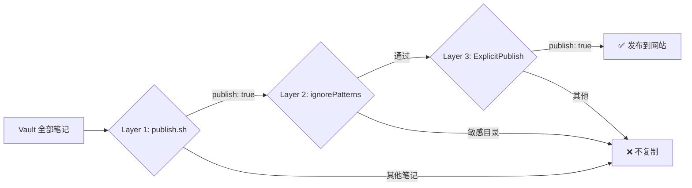

## 前言

Obsidian 的付费同步和发布功能价格不菲，而我只想把**极少数笔记**分享到个人博客上。大量个人笔记（日记、财务、求职等）绝对不能被公开。

所以核心需求是：**默认不发布任何东西**，只有我明确标记的笔记才会出现在网站上。

本文记录了使用 [[从Notion迁移笔记，及Obsidian配合OpenCode使用|OpenCode]] 配合 Quartz 搭建这套选择性发布流程的完整过程。

> [!INFO] TL;DR
> - 使用 Quartz v4 替代 Hugo，原生支持 Obsidian 语法（wikilinks、callouts、embeds）
> - 三层安全模型（Defense in Depth）：脚本过滤 + 构建时忽略 + 插件拦截
> - 只需在笔记 frontmatter 中添加 `publish: true` 即可发布
> - `publish.sh` 一键同步 + 部署到 GitHub Pages

## 工具选型

在选择发布工具时，对比了以下方案：

| 工具 | Obsidian 语法支持 | 选择性发布 | 部署方式 | 评价 |
|------|:---:|:---:|------|------|
| **Quartz v4** | ✅ 原生 | ✅ ExplicitPublish 插件 | GitHub Pages | 最佳平衡 |
| Hugo | ❌ 需转换 | ⚠️ 需手动 draft | GitHub Pages | 语法不兼容 |
| Digital Garden | ✅ 原生 | ✅ 内置 | Vercel/Netlify | 依赖第三方平台 |
| MkDocs | ⚠️ 部分 | ❌ 全量发布 | 任意 | 适合文档站 |

最终选择 **Quartz v4**：原生支持 `[[wikilinks]]`、`> [!callout]`、`![[embeds]]`，且内置 `ExplicitPublish` 过滤器，天然契合选择性发布需求。

## 三层安全模型

为确保私密笔记不被发布，设计了三层防护机制，任何一层都能独立阻止未授权内容：



### Layer 1：`publish.sh` 脚本过滤

同步脚本只复制满足以下条件的 `.md` 文件：
1. 不在黑名单文件夹中
2. frontmatter 包含 `publish: true`
3. frontmatter 中 `draft` 不为 `true`

```bash
# 示例：黑名单配置
BLOCKLIST_PATTERNS=(
    "私密文件夹/*"
    "*/私密文件夹/*"
    # ... 其他敏感目录
)
```

### Layer 2：Quartz `ignorePatterns`

即使文件意外泄露到 `content/` 目录，Quartz 构建时也会按 glob 模式忽略敏感路径：

```typescript
// quartz.config.ts
ignorePatterns: [
    "private",
    "**/敏感目录/**",
    // ... 其他模式
],
```

### Layer 3：Quartz `ExplicitPublish` 插件

最后一道防线——Quartz 内置的 `ExplicitPublish` 过滤器只渲染 frontmatter 中包含 `publish: true` 的文件：

```typescript
// quartz.config.ts
filters: [Plugin.ExplicitPublish()],
```

> [!WARNING] 安全提醒
> 三层防护意味着：即使你不小心把整个 Vault 复制到了 `site/content/`，没有 `publish: true` 的笔记仍然不会被构建和发布。

## 搭建步骤

### 1. 安装 Quartz

```bash
# 在 Vault 根目录下
git clone https://github.com/jackyzha0/quartz.git site
cd site
npm install
```

### 2. 配置 `quartz.config.ts`

关键配置项：

```typescript
const config: QuartzConfig = {
    configuration: {
        pageTitle: "你的站点名",
        locale: "zh-CN",
        baseUrl: "yourusername.github.io",
        // Layer 2：敏感目录忽略模式
        ignorePatterns: ["private", "**/敏感目录/**"],
    },
    plugins: {
        // Layer 3：只发布明确标记的笔记
        filters: [Plugin.ExplicitPublish()],
    },
}
```

> [!TIP] 中文字体
> 建议在 `theme.typography` 中使用 `Noto Sans SC`（Google Fonts），中文显示效果更好。

### 3. 编写同步脚本 `scripts/publish.sh`

脚本做以下事情：
1. 清空 `site/content/` 目录
2. 扫描 Vault 中所有 `.md` 文件
3. 过滤：黑名单文件夹 → `publish: true` 检查 → `draft` 检查
4. 复制通过检查的笔记到 `site/content/`，保持目录结构
5. 提取并复制笔记中引用的图片（支持 `![[image.png]]` 和 `` 两种语法）
6. 如果使用 `--push` 参数，自动提交并推送到远程

### 4. 配置 GitHub Actions

在 `site/.github/workflows/deploy.yml` 中配置自动部署：

```yaml
name: Deploy Quartz site to GitHub Pages

on:
  push:
    branches: [v4]

jobs:
  build-and-deploy:
    runs-on: ubuntu-latest
    permissions:
      contents: read
      pages: write
      id-token: write
    steps:
      - uses: actions/checkout@v4
      - uses: actions/setup-node@v4
        with:
          node-version: 22
      - run: npm ci
      - run: npx quartz build
      - uses: actions/upload-pages-artifact@v3
        with:
          path: public
      - uses: actions/deploy-pages@v4
```

> [!INFO] GitHub Pages 设置
> 在仓库 Settings → Pages 中，将 Source 设置为 **GitHub Actions**。

### 5. 标记笔记为发布

在想要发布的笔记 frontmatter 中添加：

```yaml
---
title: "笔记标题"
publish: true
description: "简短描述"
tags:
  - 标签1
  - 标签2
---
```

只有包含 `publish: true` 的笔记才会被发布到网站。

## 日常使用

### 发布笔记的三种方式

#### 方式 1：预览（--dry-run）

```bash
./scripts/publish.sh --dry-run
```

**作用**：显示哪些笔记会被发布，**不复制任何文件**。用于验证发布策略是否正确。

**输出示例**：
```
Scanning vault for publishable notes...

  ✅ PUBLISH  Work/Tools/Obsidian/我的笔记.md
  🚫 BLOCKED  Daily/2026-03-13.md
  ⏭️  SKIPPED  Personal/财务规划.md (no publish: true)

───────────────────────────────────
  Results:
    ✅ Published:     1 notes
    🚫 Blocked:       1 notes (in blocklisted folders)
    ⏭️  Skipped:       1 notes (no publish: true)
    🖼️  Images copied: 0
───────────────────────────────────
  (Dry run — no files were copied)
```

#### 方式 2：本地构建（不推送）

```bash
./scripts/publish.sh
```

**工作流**：
```
复制笔记到 site/content/
    ↓
提取并复制引用的图片
    ↓
❌ 不自动提交/推送
```

**后续**：你可以本地预览，然后手动 git 操作
```bash
cd site
npx quartz build --serve --port 8080
# 访问 http://localhost:8080 预览效果
```

#### 方式 3：完整自动部署（--push）✅ **推荐日常使用**

```bash
./scripts/publish.sh --push
```

**完整工作流**：
```
复制笔记到 site/content/
    ↓
git add -A
    ↓
git commit -m "publish: sync X notes from vault"
    ↓
git push origin v4（或 main）
    ↓
GitHub 接收 push → 触发 GitHub Actions
    ↓
Actions 自动执行 deploy.yml：
  - npm ci
  - npx quartz build
  - 部署到 GitHub Pages
    ↓
几分钟后网站自动更新 ✅
```

### 本地预览

不使用 `--push` 时，可以手动预览：

```bash
# 同步笔记
./scripts/publish.sh

# 启动本地服务
cd site
npx quartz build --serve --port 8080
```

然后访问 `http://localhost:8080` 预览效果。

### 取消发布

#### 方式 A：修改 frontmatter

将笔记中的 `publish: true` 改为 `publish: false` 或直接删除该字段：

```yaml
---
title: "不再发布的笔记"
publish: false  # ← 改这里
---
```

#### 方式 B：移动到黑名单文件夹

将笔记移到 `BLOCKLIST_PATTERNS` 中的文件夹（例如 `Daily/`、`Personal Home/`、`Job/` 等）。

#### 部署更改

执行以下命令使更改上线：

```bash
./scripts/publish.sh --push
```

脚本会自动从网站移除取消发布的笔记。

### 设置英文别名（English Aliases）

如果你希望在网站上为笔记创建英文访问路径（例如 `/my-english-slug`），可以在笔记的 frontmatter 中添加 `en_slug` 和/或 `en_aliases`。这些字段仅在发布时使用，不会影响你本地 Obsidian 中的笔记。

#### 方案 1：设置单个英文 slug（推荐）

```yaml
---
title: "我的中文笔记标题"
publish: true
en_slug: my-english-slug
---
```

这会为笔记生成英文访问路径 `/my-english-slug`，而默认中文路径仍然有效。

#### 方案 2：添加多个英文别名

如果你想支持多个英文访问路径（用于 SEO 或处理旧 URL），可以添加 `en_aliases`：

**方式 A：内联列表**
```yaml
---
title: "我的笔记"
publish: true
en_slug: new-url
en_aliases: ["old-url", "legacy/path"]
---
```

**方式 B：块级列表（YAML 风格）**
```yaml
---
title: "我的笔记"
publish: true
en_slug: new-url
en_aliases:
  - old-url
  - legacy/path
---
```

这两种方式效果相同。Quartz 会为这些别名自动生成重定向页面（使用 `AliasRedirects` 插件），访客访问旧 URL 时会被重定向到新的规范 URL。

#### 发布流程

当你运行 `publish.sh` 时，脚本会自动：
1. 检测你笔记中的 `en_slug` 和 `en_aliases` 字段
2. 将其转换为 Quartz 理解的 `permalink` 和 `aliases` 字段
3. 注入到 `site/content/` 中的复制文件
4. Quartz 构建时使用这些字段生成正确的 URL 和重定向页面

**你的源笔记保持不变**——英文字段的转换只发生在发布时的复制过程中。

#### 完整示例

假设你有一篇关于 Obsidian 的中文笔记：

```yaml
---
title: "Obsidian 使用技巧"
publish: true
en_slug: obsidian-tips
en_aliases:
  - "obsidian-guide"
  - "tips-and-tricks"
tags:
  - Obsidian
  - 笔记
description: "Obsidian 的各种实用技巧和工作流优化方法"
---
```

发布后，访客可以通过以下任何路径访问这篇笔记：
- `/obsidian-tips`（主路径，由 `en_slug` 定义）
- `/obsidian-guide`（别名 1，自动重定向）
- `/tips-and-tricks`（别名 2，自动重定向）

#### 常见问题

**Q：如果不设置 `en_slug`，笔记用什么 URL？**

A：Quartz 会使用默认的基于文件路径的 slug（例如 `Work/Tools/Obsidian/我的笔记`）。设置 `en_slug` 可以提供一个更简洁的英文 URL。

**Q：我想改变已发布笔记的 `en_slug`，怎么做？**

A：修改笔记中的 `en_slug` 字段，然后运行 `./scripts/publish.sh --push`。如果旧 URL 被搜索引擎索引，建议在 `en_aliases` 中添加旧 slug 作为重定向，以保持 SEO 友好性。

**Q：`en_slug` 和 `slug` 有区别吗？**

A：有。`slug` 是 Obsidian 标准字段（Quartz 的 `SlugOverride` 插件识别），可以完全覆盖默认 slug。而 `en_slug` 是发布脚本自定义的字段，用于特定的英文 URL 需求。两者都可以使用，但 `en_slug` 的意图更清晰。

## GitHub Actions 工作流详解

### 架构概览

你的发布系统由两个独立的仓库和两个 GitHub Actions 工作流组成：

```
┌──────────────────────────────────────┐
│  Vault 仓库（padXero/Pity）          │
│  .github/workflows/notify-pages.yml  │
│  main 分支有更新                      │
└──────────────┬───────────────────────┘
               │
               │ 触发事件 (repository_dispatch)
               │
               ↓
┌──────────────────────────────────────────────┐
│  网站仓库（TentacleCat/tentaclecat.github.io) │
│  .github/workflows/deploy.yml                │
│  自动构建 + 部署到 GitHub Pages              │
└──────────────────────────────────────────────┘
```

### Vault 仓库工作流：notify-pages.yml

**作用**：监听 Vault 仓库 main 分支的 push，触发网站仓库的部署。

```yaml
name: Notify Pages Repo

on:
  push:
    branches:
      - main  # ← 当你 push 到 main 分支时触发

jobs:
  dispatch:
    runs-on: ubuntu-latest
    steps:
      - name: Repository Dispatch
        uses: actions/github-script@v7
        with:
          github-token: ${{ secrets.PAT_TOKEN }}  # ← Personal Access Token（见下方说明）
          script: |
            github.rest.repos.createDispatchEvent({
              owner: 'TentacleCat',
              repo: 'tentaclecat.github.io',
              event_type: 'sync-vault',
              client_payload: {
                ref: '${{ github.ref }}',
                sha: '${{ github.sha }}'
              }
            })
```

### 网站仓库工作流：deploy.yml

**作用**：接收 Vault 仓库的触发信号，自动构建 Quartz 网站并部署到 GitHub Pages。

```yaml
name: Deploy Quartz to GitHub Pages

on:
  push:
    branches:
      - v4
      - main
  repository_dispatch:         # ← 接收来自 Vault 仓库的触发信号
    types: [sync-vault]
  workflow_dispatch:           # ← 允许手动触发

jobs:
  build:
    runs-on: ubuntu-latest
    steps:
      - uses: actions/checkout@v4
      - uses: actions/setup-node@v4
        with:
          node-version: 22
      - run: npm ci
      - run: npx quartz build  # ← 构建静态网站
      - uses: actions/upload-pages-artifact@v3
        with:
          path: public

  deploy:
    needs: build
    runs-on: ubuntu-latest
    steps:
      - name: Deploy to GitHub Pages
        uses: actions/deploy-pages@v4  # ← 部署到 GitHub Pages
```

### Personal Access Token（PAT_TOKEN）详解

#### 它是什么？

Personal Access Token 是一个**允许应用程序代表你访问 GitHub 账户的密钥**。

#### 为什么需要它？

在你的场景中：

- **Vault 仓库**和**网站仓库**是**两个独立的仓库**
- Vault 工作流需要**跨越两个仓库的边界**，去触发网站仓库的部署
- GitHub 不允许一个仓库直接操作另一个仓库，除非有明确的授权凭证

```
┌─────────────────────────────────┐
│  Vault 仓库中的 GitHub Action   │
│  （无权限访问其他仓库）         │
└────────────────┬────────────────┘
                 │
                 │ PAT_TOKEN 作为"授权凭证"
                 ↓
┌─────────────────────────────────┐
│  网站仓库                         │
│  （获得访问权限）                │
└─────────────────────────────────┘
```

#### 权限对比

| 场景 | 使用的凭证 | 权限范围 | 能否跨仓库 |
|------|----------|--------|---------|
| 在同一仓库内操作 | `GITHUB_TOKEN`（自动） | 仅限当前仓库 | ❌ 否 |
| 从 A 仓库操作 B 仓库 | `PAT_TOKEN`（手动配置） | 你拥有权限的所有仓库 | ✅ 是 |

#### 安全性说明

- PAT_TOKEN **只能读写你有权限的仓库**（通常是你自己的账户下的仓库）
- 它**不是密码**，丢失或泄露只需重新生成即可
- 建议：
  - 使用 **90 天**自动过期设置
  - 定期更新和轮换 token
  - 仅授予必要的权限范围（在这里只需 `repo` scope）

#### 创建 PAT_TOKEN

**步骤 1：生成 Token**

1. 访问 GitHub Settings → Developer settings → Personal access tokens → Tokens (classic)
2. 点击 "Generate new token (classic)"
3. 设置如下：
   - **Token name**: `Vault Sync Token`
   - **Expiration**: `90 days`
   - **Scopes**: 勾选 `repo`（完全仓库访问）
4. 点击 "Generate token"
5. **立即复制 token**（只显示一次，刷新后看不到）

**步骤 2：添加到 Vault 仓库的 Secret**

1. 打开 Vault 仓库（padXero/Pity）
2. 进入 Settings → Secrets and variables → Actions
3. 点击 "New repository secret"
4. **Name**: `PAT_TOKEN`
5. **Value**: 粘贴刚才复制的 token
6. 点击 "Add secret"

**完成后，Vault 工作流就有权限触发网站仓库的部署了！**

### 工作流执行过程

详细的执行链路：

```
Day 1: 编写笔记
├─ 在 Obsidian 中编辑笔记
├─ 添加 publish: true 到 frontmatter
└─ Obsidian 同步到 Vault 仓库（或手动 push）

Day 2: 发布
├─ 运行 ./scripts/publish.sh --push
│  ├─ 扫描 Vault 中的 .md 文件
│  ├─ Layer 1 过滤：黑名单、publish: true、draft 检查
│  ├─ 复制到 site/content/
│  ├─ git add -A && git commit && git push origin v4
│  └─ push 到 Vault 仓库的 v4 分支
│
├─ GitHub 接收 Vault 仓库的 push 到 main 分支
│  └─ 触发 notify-pages.yml 工作流
│
├─ notify-pages.yml 执行
│  ├─ 使用 PAT_TOKEN 认证
│  └─ 向网站仓库发送 repository_dispatch 事件（sync-vault）
│
├─ GitHub 接收网站仓库的 dispatch 事件
│  └─ 触发 deploy.yml 工作流
│
└─ deploy.yml 自动执行
   ├─ 拉取网站仓库的最新代码（包含 site/ 目录）
   ├─ npm ci（安装依赖）
   ├─ npx quartz build（构建网站）
   │  ├─ Layer 2 过滤：ignorePatterns
   │  └─ Layer 3 过滤：ExplicitPublish 插件
   ├─ 生成 public/ 目录（静态网站）
   └─ 部署到 GitHub Pages
        ↓
   网站上线！✅
```

### 常见问题

**Q：为什么 notify-pages.yml 在 Vault 仓库，而 deploy.yml 在网站仓库？**

A：这样可以保持关注分离（Separation of Concerns）：
- Vault 仓库：只关心**什么笔记被发布**（publish.sh 的职责）
- 网站仓库：只关心**如何构建和部署网站**（Quartz 的职责）
- 两者通过事件解耦，互不干扰

**Q：PAT_TOKEN 会过期吗？**

A：是的。建议设置 90 天自动过期，然后定期更新。当 token 过期后，工作流会失败，需要生成新 token 并更新 Secret。

**Q：可以不用 PAT_TOKEN 吗？**

A：可以，但需要改变架构。另一种方案是：
- 不使用 `repository_dispatch`
- 在 Vault 仓库中直接 push 到网站仓库的 `v4` 分支
- 这样网站仓库的 `deploy.yml` 会自动触发
- 但这需要更复杂的 git 权限配置

**Q：如果 PAT_TOKEN 泄露了怎么办？**

A：
1. 立即访问 GitHub Settings → Personal access tokens 删除该 token
2. 生成新 token
3. 更新 Vault 仓库的 Secret
4. 新 token 立即生效，旧 token 无法使用


## Quartz 特性

Quartz 原生支持大量 Obsidian 语法，无需额外配置：

- **Wikilinks**：`[[其他笔记]]`、`[[笔记|显示文本]]`
- **Callouts**：`> [!INFO]`、`> [!WARNING]` 等
- **图片嵌入**：`![[image.png]]`
- **Mermaid 图表**：代码块中使用 `mermaid` 语言标识
- **LaTeX 数学公式**：`$行内公式$` 和 `$$块级公式$$`
- **代码高亮**：支持语法高亮的代码块
- **反向链接**：自动显示引用当前笔记的其他笔记
- **图谱视图**：可视化笔记之间的链接关系
- **全文搜索**：内置搜索功能

## 目录结构

```
Vault/
├── scripts/
│   └── publish.sh          # 同步脚本（Layer 1）
├── site/                    # Quartz 安装目录
│   ├── quartz.config.ts     # Quartz 配置（Layer 2 + 3）
│   ├── quartz.layout.ts     # 布局配置
│   ├── content/             # 同步后的发布内容
│   ├── public/              # 构建输出
│   └── .github/workflows/   # GitHub Actions
├── Work/                    # 工作笔记
│   └── Tools/
│       └── Obsidian/        # 本文所在位置
└── ...                      # 其他笔记（默认不发布）
```

## 故障排查

### GitHub Actions 工作流失败

#### 问题：`Bad credentials`

**原因**：PAT_TOKEN 未配置或已过期

**解决方案**：
1. 访问 GitHub Settings → Personal access tokens
2. 生成新 token（或检查现有 token 是否过期）
3. 更新 Vault 仓库的 Secret

#### 问题：`Node.js 20 deprecated warning`

**原因**：某些 Action 版本过时

**解决方案**：自动解决（系统会建议升级 Action 版本）

### publish.sh 脚本错误

#### 问题：`ERROR: Site directory not found`

**原因**：Quartz 未安装

**解决方案**：
```bash
git clone https://github.com/jackyzha0/quartz.git site
cd site
npm install
```

#### 问题：`⚠️  No notes to publish!`

**原因**：没有笔记包含 `publish: true`

**解决方案**：在 frontmatter 中添加 `publish: true`

## 完整工作流总结

### 一键发布（推荐）

```bash
./scripts/publish.sh --push
```

这一条命令完成：

1. ✅ 扫描 Vault 中的笔记
2. ✅ 应用三层安全过滤
3. ✅ 复制到 `site/content/`
4. ✅ 提取并复制引用的图片
5. ✅ Git 提交和推送
6. ✅ 触发 GitHub Actions
7. ✅ 自动构建 + 部署到 GitHub Pages

**整个过程完全自动化，无需手动干预。**

## 参考链接

- [Quartz 官方文档](https://quartz.jzhao.xyz)
- [Quartz 配置指南](https://quartz.jzhao.xyz/configuration)
- [Quartz ExplicitPublish 插件](https://quartz.jzhao.xyz/plugins/ExplicitPublish)
- [GitHub Pages 文档](https://docs.github.com/en/pages)
- [GitHub Actions 文档](https://docs.github.com/en/actions)
- [Personal Access Tokens](https://docs.github.com/en/authentication/keeping-your-account-and-data-secure/managing-your-personal-access-tokens)
- [Obsidian Flavored Markdown](https://help.obsidian.md/obsidian-flavored-markdown)
- [Repository Dispatch 事件](https://docs.github.com/en/actions/using-workflows/events-that-trigger-workflows#repository_dispatch)
