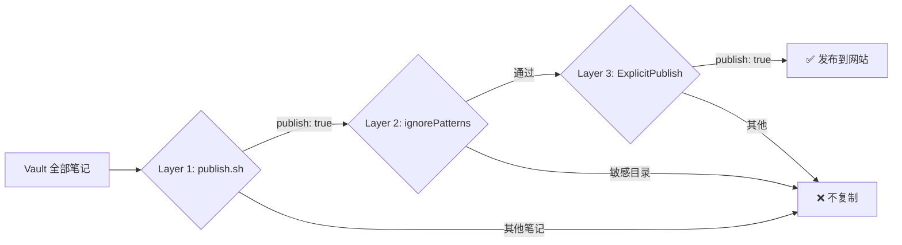

## 前言

Obsidian 的付费同步和发布功能价格不菲，而我只想把**极少数笔记**分享到个人博客上。大量个人笔记（日记、财务、求职等）绝对不能被公开。

所以核心需求是：**默认不发布任何东西**，只有我明确标记的笔记才会出现在网站上。

本文记录了使用 [[从Notion迁移笔记，及Obsidian配合OpenCode使用|OpenCode]] 配合 Quartz 搭建这套选择性发布流程的完整过程。

> [!INFO] TL;DR
> - 使用 Quartz v4 替代 Hugo，原生支持 Obsidian 语法（wikilinks、callouts、embeds）
> - 三层安全模型（Defense in Depth）：脚本过滤 + 构建时忽略 + 插件拦截
> - 只需在笔记 frontmatter 中添加 `publish: true` 即可发布
> - `publish.sh` 一键同步 + 部署到 GitHub Pages

## 工具选型

在选择发布工具时，对比了以下方案：

| 工具 | Obsidian 语法支持 | 选择性发布 | 部署方式 | 评价 |
|------|:---:|:---:|------|------|
| **Quartz v4** | ✅ 原生 | ✅ ExplicitPublish 插件 | GitHub Pages | 最佳平衡 |
| Hugo | ❌ 需转换 | ⚠️ 需手动 draft | GitHub Pages | 语法不兼容 |
| Digital Garden | ✅ 原生 | ✅ 内置 | Vercel/Netlify | 依赖第三方平台 |
| MkDocs | ⚠️ 部分 | ❌ 全量发布 | 任意 | 适合文档站 |

最终选择 **Quartz v4**：原生支持 `[[wikilinks]]`、`> [!callout]`、`![[embeds]]`，且内置 `ExplicitPublish` 过滤器，天然契合选择性发布需求。

## 三层安全模型

为确保私密笔记不被发布，设计了三层防护机制，任何一层都能独立阻止未授权内容：



### Layer 1：`publish.sh` 脚本过滤

同步脚本只复制满足以下条件的 `.md` 文件：
1. 不在黑名单文件夹中
2. frontmatter 包含 `publish: true`
3. frontmatter 中 `draft` 不为 `true`

```bash
# 示例：黑名单配置
BLOCKLIST_PATTERNS=(
    "私密文件夹/*"
    "*/私密文件夹/*"
    # ... 其他敏感目录
)
```

### Layer 2：Quartz `ignorePatterns`

即使文件意外泄露到 `content/` 目录，Quartz 构建时也会按 glob 模式忽略敏感路径：

```typescript
// quartz.config.ts
ignorePatterns: [
    "private",
    "**/敏感目录/**",
    // ... 其他模式
],
```

### Layer 3：Quartz `ExplicitPublish` 插件

最后一道防线——Quartz 内置的 `ExplicitPublish` 过滤器只渲染 frontmatter 中包含 `publish: true` 的文件：

```typescript
// quartz.config.ts
filters: [Plugin.ExplicitPublish()],
```

> [!WARNING] 安全提醒
> 三层防护意味着：即使你不小心把整个 Vault 复制到了 `site/content/`，没有 `publish: true` 的笔记仍然不会被构建和发布。

## 搭建步骤

### 1. 安装 Quartz

```bash
# 在 Vault 根目录下
git clone https://github.com/jackyzha0/quartz.git site
cd site
npm install
```

### 2. 配置 `quartz.config.ts`

关键配置项：

```typescript
const config: QuartzConfig = {
    configuration: {
        pageTitle: "你的站点名",
        locale: "zh-CN",
        baseUrl: "yourusername.github.io",
        // Layer 2：敏感目录忽略模式
        ignorePatterns: ["private", "**/敏感目录/**"],
    },
    plugins: {
        // Layer 3：只发布明确标记的笔记
        filters: [Plugin.ExplicitPublish()],
    },
}
```

> [!TIP] 中文字体
> 建议在 `theme.typography` 中使用 `Noto Sans SC`（Google Fonts），中文显示效果更好。

### 3. 编写同步脚本 `scripts/publish.sh`

脚本做以下事情：
1. 清空 `site/content/` 目录
2. 扫描 Vault 中所有 `.md` 文件
3. 过滤：黑名单文件夹 → `publish: true` 检查 → `draft` 检查
4. 复制通过检查的笔记到 `site/content/`，保持目录结构
5. 提取并复制笔记中引用的图片（支持 `![[image.png]]` 和 `` 两种语法）
6. 如果使用 `--push` 参数，自动提交并推送到远程

### 4. 配置 GitHub Actions

在 `site/.github/workflows/deploy.yml` 中配置自动部署：

```yaml
name: Deploy Quartz site to GitHub Pages

on:
  push:
    branches: [v4]

jobs:
  build-and-deploy:
    runs-on: ubuntu-latest
    permissions:
      contents: read
      pages: write
      id-token: write
    steps:
      - uses: actions/checkout@v4
      - uses: actions/setup-node@v4
        with:
          node-version: 22
      - run: npm ci
      - run: npx quartz build
      - uses: actions/upload-pages-artifact@v3
        with:
          path: public
      - uses: actions/deploy-pages@v4
```

> [!INFO] GitHub Pages 设置
> 在仓库 Settings → Pages 中，将 Source 设置为 **GitHub Actions**。

### 5. 标记笔记为发布

在想要发布的笔记 frontmatter 中添加：

```yaml
---
title: "笔记标题"
publish: true
description: "简短描述"
tags:
  - 标签1
  - 标签2
---
```

只有包含 `publish: true` 的笔记才会被发布到网站。

## 日常使用

### 发布笔记

```bash
# 预览哪些笔记会被发布（不实际复制）
./scripts/publish.sh --dry-run

# 同步 + 本地构建
./scripts/publish.sh

# 同步 + 提交 + 推送（触发 GitHub Actions 自动部署）
./scripts/publish.sh --push
```

### 本地预览

```bash
cd site
npx quartz build --serve --port 8080
```

然后访问 `http://localhost:8080` 预览效果。

### 取消发布

将笔记中的 `publish: true` 改为 `publish: false` 或直接删除该字段，然后重新运行 `publish.sh --push`。

## Quartz 特性

Quartz 原生支持大量 Obsidian 语法，无需额外配置：

- **Wikilinks**：`[[其他笔记]]`、`[[笔记|显示文本]]`
- **Callouts**：`> [!INFO]`、`> [!WARNING]` 等
- **图片嵌入**：`![[image.png]]`
- **Mermaid 图表**：代码块中使用 `mermaid` 语言标识
- **LaTeX 数学公式**：`$行内公式$` 和 `$$块级公式$$`
- **代码高亮**：支持语法高亮的代码块
- **反向链接**：自动显示引用当前笔记的其他笔记
- **图谱视图**：可视化笔记之间的链接关系
- **全文搜索**：内置搜索功能

## 目录结构

```
Vault/
├── scripts/
│   └── publish.sh          # 同步脚本（Layer 1）
├── site/                    # Quartz 安装目录
│   ├── quartz.config.ts     # Quartz 配置（Layer 2 + 3）
│   ├── quartz.layout.ts     # 布局配置
│   ├── content/             # 同步后的发布内容
│   ├── public/              # 构建输出
│   └── .github/workflows/   # GitHub Actions
├── Work/                    # 工作笔记
│   └── Tools/
│       └── Obsidian/        # 本文所在位置
└── ...                      # 其他笔记（默认不发布）
```

## 参考链接

- [Quartz 官方文档](https://quartz.jzhao.xyz)
- [Quartz 配置指南](https://quartz.jzhao.xyz/configuration)
- [Quartz ExplicitPublish 插件](https://quartz.jzhao.xyz/plugins/ExplicitPublish)
- [GitHub Pages 文档](https://docs.github.com/en/pages)
- [Obsidian Flavored Markdown](https://help.obsidian.md/obsidian-flavored-markdown)
